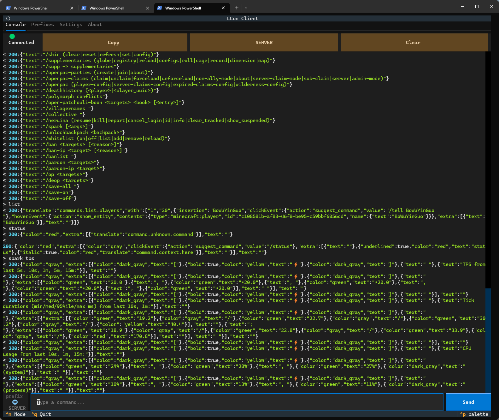

> **[📖 English](README.md)**
> **[📖 中文](README.zh-cn.md)**

[](https://github.com/VincentZyuApps/lcon)
[](https://gitee.com/vincent-zyu/lcon)


# 🎮 LCon — 通过 WebSocket 远程控制 Minecraft 客户端

> 🧩 一个 Forge 模组，在 Minecraft **客户端**（单人/局域网）中运行 WebSocket 服务端，让外部应用可以远程执行指令和与游戏实时交互。
<p align="center">
  
</p>

>
> 💡 **原理** — 当你游玩单人游戏或开启局域网时，客户端底层会运行一个**集成服务端** — 与专用服务端拥有相同的命令引擎、世界更新循环和游戏逻辑。

> 
> ☝️🤓 在 Minecraft 中，"单人游戏"、"多人游戏"、"局域网联机"、"服务器"底层跑的都是同一套服务端代码，没有本质区别。LCon 接入这个集成服务端，同时启动一个 WebSocket 服务端，让外部工具无需独立服务端即可控制游戏。

[](https://files.minecraftforge.net/net/minecraftforge/forge/index_1.20.1.html)
[](https://adoptium.net/temurin/releases/?version=17)
[](https://gradle.org)

[](https://github.com/VincentZyuApps/lcon/releases)

[](https://github.com/VincentZyuApps/lcon/commits/master)
[](https://github.com/VincentZyuApps/lcon/actions)
## 🧩 功能说明

LCon 在你进入世界（单人或局域网）时，在 Minecraft 客户端内启动一个 **WebSocket 服务端**。你可以用任何 WebSocket 客户端连接它 — Python 脚本 🤖、聊天机器人 💬、网页控制面板 📊 等：

| 🏷️ 前缀 | ⚡ 行为 |
|--------|--------|
| `[chat]<消息>` | 以玩家身份发送聊天消息 |
| `[message]<消息>` | 仅向该玩家显示消息 |
| `[system]<消息>` | 在聊天中显示系统消息 |
| `[client]/<指令>` | 执行**客户端侧**指令 |
| `[server]/<指令>` | 执行**服务端侧**指令 |

✅ 不含 Mixin、无 Coremod、无覆写 — 纯事件驱动，安全兼容任何整合包。

## 🔌 如何连接

### 📦 模组安装

1. 从 [Releases](https://github.com/VincentZyuApps/lcon/releases) 下载最新的 `.jar`
2. 放入客户端 `mods/` 文件夹
3. 启动 Minecraft — 首次加载模组时会自动在 `config/` 文件夹生成 `lcon-ws-server.toml`

> ⚠️ **`mods/` 和 `config/` 必须在同级目录下。**  
> 典型结构：`.minecraft/mods/lcon-*.jar` + `.minecraft/config/lcon-ws-server.toml`

### 🐍 使用 Python（uv）

```bash
uv venv --python 3.13
uv pip install websocket-client
uv run python -c "
import websocket
ws = websocket.create_connection('ws://localhost:58115')
print(ws.recv())     # 欢迎消息
ws.send('[server]/say Hello from LCon!')
print(ws.recv())     # 响应
ws.close()
"
```

### 🪢 使用 wscat（npx）

```bash
npx wscat -c ws://localhost:58115
```

连接成功后，服务端会推送欢迎消息：

```log
< 200:Welcome to LCon! Have fun! Don't forget to use prefixes with every message you send to me.
< 200:Valid prefixes:
< 200:[chat] - send message to Minecraft chat.
< 200:[server] - execute server-side command.
< 201:ready.
```

然后发送带前缀的指令（`> `是你输入，`< `是服务端响应）：

```powershell
> [server]/say Hello everyone!
# (指令已执行 — 无响应文本，但聊天栏会出现消息)

> [chat]Hello!
# (以玩家身份发送聊天消息)

> [server]/give @s diamond 64
# (指令已执行 — 钻石出现在背包)

> unknown
#  400:Error! Send message prefix first! [chat], [message], [system], [client], [server] are valid prefixes.
```

### 🐍 Python 客户端 (TUI)

基于 Textual 的终端界面，支持标签页切换（Console、Commands、Settings、About）。

<p align="center">
  
</p>

#### 🚀 快速开始

```bash
git clone https://github.com/VincentZyuApps/lcon.git
cd lcon

uv venv --python 3.13
uv pip install textual websocket-client

uv run python ./client/main.py
```

#### 🌐 环境变量

| 🏷️ 变量 | 📄 默认值 | 📝 说明 |
|----------|---------|-------------|
| `LCON_HOST` | `localhost` | WebSocket 服务端地址 |
| `LCON_PORT` | `58115` | WebSocket 端口 |
| `LCON_TOKEN` | `your_secret_token` | 认证令牌 |
| `LCON_SOFT_WRAP` | `true` | 启用控制台日志自动换行（`true`/`false`） |
| `LCON_LOG_BUFFER` | `1000` | 控制台日志保留的最大行数 |
| `LCON_AUTO_MODE` | `true` | 发送消息时自动添加前缀（`true`/`false`） |

### 📄 .env 文件（可选）

复制示例文件并编辑：

```bash
cp config/.env.example config/.env
```

优先级：环境变量 → `config/.env` → 代码内硬编码默认值。

**bash (Linux / macOS / WSL / Git Bash):**
```bash
LCON_HOST=192.168.1.100 LCON_PORT=58115 LCON_TOKEN=your_secret_token
uv run python client/main.py
```

**PowerShell (Windows):**
```powershell
$env:LCON_HOST="192.168.1.100"; $env:LCON_PORT="58115"; $env:LCON_TOKEN="your_secret_token"
uv run python client/main.py
```

**CMD (Windows):**
```cmd
set LCON_HOST=192.168.1.100 && set LCON_PORT=58115 && set LCON_TOKEN=your_secret_token
uv run python client/main.py
```

## ⚙️ 配置

文件：`.minecraft/config/lcon-ws-server.toml`

| ⚙️ 选项 | 🏷️ 类型 | 📄 默认值 | 📝 说明 |
|--------|------|---------|-------------|
| `enable_mod` | boolean | `true` | 启用 WebSocket 服务端 |
| `port` | int | `58115` | WebSocket 服务端端口 |
| `token` | string | `your_secret_token` | 认证令牌。客户端连接时传 `?token=xxx` |
| `command_permission_level` | int | `4` | `[server]` 指令的 OP 等级 (0-4)。4 = 不开作弊也能执行所有指令 |
| `serializer_mode` | string | `json` | 消息序列化方式：`json`（推荐 Python TUI 使用）或 `tostring` |
| `enable_message_emoji` | boolean | `true` | 消息 emoji 总开关 |
| `emoji_*` | string | various | 13 条消息的 emoji 设置（如 `emoji_welcome`、`emoji_chat`） |
| `msg_*` | string | various | 13 条消息的文本设置（如 `msg_welcome`、`msg_chat`） |

> 💡 使用 Python TUI 客户端时，请在 `lcon-ws-server.toml` 中设置 `serializer_mode = "json"` 以获得最佳兼容性。

## 🏗 构建

### 🛠️ 本地构建

```bash
./gradlew build
```

📦 输出：`build/libs/lcon-*.jar`

### 🤖 GitHub Actions CI

推送至任意分支时，提交信息中包含特定关键词可触发构建：

| 提交信息包含 | 触发行为 |
|------------------------|-------------|
| `build action` | 构建 + 上传构建产物 |
| `build release` | 构建 + 创建 GitHub Release |

```bash
git commit -m "fix: something; build action"
git commit -m "feat: something; build release"
```

## 📦 技术栈

### 🖥️ 服务端（Forge 模组）

| 依赖 | 版本 | 说明 |
|:---|---:|:---|
| [](https://adoptium.net/temurin/releases/?version=17) | 17 | 运行环境 |
| [](https://files.minecraftforge.net/net/minecraftforge/forge/index_1.20.1.html) | 47.2.19 | Mod 加载器 |
| [](https://gradle.org) | 8.1.1 | 构建工具 |
| [](https://imperceptiblethoughts.com/shadow/) | 7.1.0 | Fat-jar 插件 |
| [](https://github.com/TooTallNate/Java-WebSocket) | 1.5.6 | WebSocket 服务端（打包进 jar） |
| [](https://github.com/VincentZyuApps/lcon/actions) | — | GitHub CI/CD |

### 🐍 客户端（Python TUI）

| 依赖 | 版本 | 说明 |
|:---|---:|:---|
| [](https://python.org) | 3.13 | 运行环境 |
| [](https://github.com/textualize/textual) | ≥8.2 | TUI 框架 |
| [](https://github.com/websocket-client/websocket-client) | ≥1.9 | WebSocket 客户端库 |
